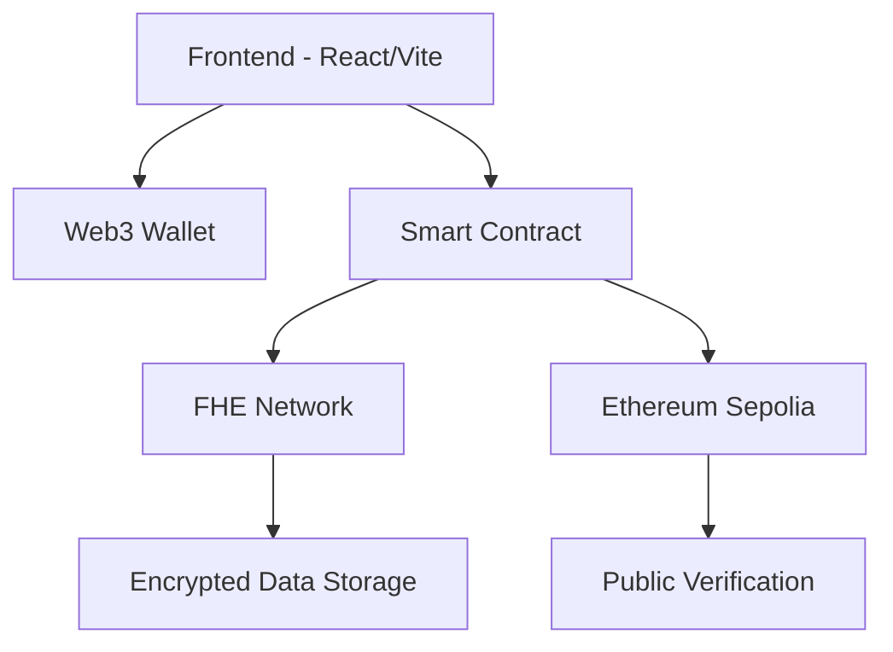

<div align="center">

# 🛡️ Secret Task Flow

**FHE-Powered Decentralized Task Management Platform**

[](https://opensource.org/licenses/MIT)
[](https://www.typescriptlang.org/)
[](https://reactjs.org/)
[](https://vitejs.dev/)
[](https://ethereum.org/)

*Privacy-First • Decentralized • Transparent*

</div>

---

## 🌟 Overview

Secret Task Flow revolutionizes task management by combining **Fully Homomorphic Encryption (FHE)** with blockchain technology to create a truly private and secure platform for decentralized organizations. Our platform ensures that sensitive task data remains encrypted even during processing, while maintaining complete transparency in results.

### 🎯 Key Features

- **🔐 FHE Encryption**: All sensitive data encrypted using Fully Homomorphic Encryption
- **🌐 Web3 Integration**: Seamless wallet connection with RainbowKit and Wagmi
- **⚡ Real-time Updates**: Instant task status updates and notifications
- **🎨 Modern UI**: Beautiful, responsive interface built with shadcn/ui
- **🔒 Privacy-First**: Anonymous task assignments preventing identity-based bias
- **📊 Transparent Results**: Public verification while maintaining contributor privacy

## 🏗️ Architecture



## 🚀 Quick Start

### Prerequisites

- **Node.js** 18+ and npm
- **Web3 Wallet** (MetaMask, Rainbow, etc.)
- **Sepolia ETH** for gas fees

### Installation

```bash
# Clone the repository
git clone https://github.com/RustyCoder77/secret-task-flow.git
cd secret-task-flow

# Install dependencies
npm install

# Start development server
npm run dev
```

### Environment Setup

Create a `.env` file in the root directory:

```env
# Blockchain Configuration
NEXT_PUBLIC_CHAIN_ID=11155111
NEXT_PUBLIC_RPC_URL=https://sepolia.infura.io/v3/YOUR_INFURA_KEY

# Wallet Connect
NEXT_PUBLIC_WALLET_CONNECT_PROJECT_ID=YOUR_PROJECT_ID

# Smart Contract (Update after deployment)
NEXT_PUBLIC_CONTRACT_ADDRESS=
```

## 🛠️ Technology Stack

### Frontend
- **React 18** - Modern UI framework
- **TypeScript** - Type-safe development
- **Vite** - Lightning-fast build tool
- **Tailwind CSS** - Utility-first styling
- **shadcn/ui** - Beautiful component library

### Web3 & Blockchain
- **RainbowKit** - Wallet connection UI
- **Wagmi** - React hooks for Ethereum
- **Viem** - TypeScript interface for Ethereum
- **Hardhat** - Smart contract development

### Security & Privacy
- **FHE (Fully Homomorphic Encryption)** - Privacy-preserving computations
- **Ethereum Sepolia** - Testnet deployment
- **Smart Contract Security** - Access controls and verification

## 📋 Usage Guide

### 1. Connect Wallet
- Click "Connect Wallet" in the header
- Select your preferred wallet (MetaMask, Rainbow, etc.)
- Ensure you're connected to Sepolia testnet

### 2. Register as Contributor
- Complete the registration process
- Your encrypted profile will be stored on-chain
- Start receiving anonymous task assignments

### 3. Task Management
- **Create Tasks**: Define tasks with encrypted details
- **Assign Tasks**: Anonymous assignment to contributors
- **Submit Work**: Encrypted submission with quality metrics
- **Verify Results**: Public verification of completed work

### 4. Privacy Features
- All sensitive data encrypted with FHE
- Anonymous contributor identities
- Transparent verification process
- Zero-knowledge task completion proofs

## 🔧 Development

### Available Scripts

```bash
# Development
npm run dev          # Start development server
npm run build        # Build for production
npm run preview      # Preview production build

# Smart Contracts
npm run contract:compile  # Compile contracts
npm run contract:deploy  # Deploy to Sepolia
npm run contract:test    # Run contract tests

# Deployment
npm run deploy:vercel    # Deploy to Vercel
npm run deploy:preview   # Deploy preview
```

### Project Structure

```
secret-task-flow/
├── 📁 contracts/           # Smart contracts
│   └── SecretTaskFlow.sol  # Main FHE contract
├── 📁 src/
│   ├── 📁 components/      # React components
│   ├── 📁 hooks/          # Custom hooks
│   ├── 📁 lib/            # Utilities & config
│   └── 📁 pages/          # Application pages
├── 📁 scripts/            # Deployment scripts
└── 📄 Configuration files
```

## 🔐 Security Considerations

### Smart Contract Security
- **Access Controls**: Role-based permissions
- **FHE Integration**: Encrypted data processing
- **Verification System**: Multi-layer validation
- **Audit Trail**: Immutable blockchain records

### Frontend Security
- **Wallet Authentication**: Secure Web3 integration
- **Input Validation**: Client-side validation
- **Environment Variables**: Secure configuration
- **HTTPS Only**: Encrypted communications

## 🚀 Deployment

### Vercel Deployment

1. **Connect Repository**
   - Import project from GitHub
   - Configure build settings (Vite preset)

2. **Environment Variables**
   - Set all required environment variables
   - Configure for all environments

3. **Deploy**
   - Automatic deployment on push
   - Preview deployments for PRs

### Smart Contract Deployment

```bash
# Deploy to Sepolia
npm run contract:deploy

# Update environment variables
NEXT_PUBLIC_CONTRACT_ADDRESS=<deployed_address>
```

## 📊 Performance

- **⚡ Fast Loading**: Vite-powered builds
- **📱 Responsive**: Mobile-first design
- **🔄 Real-time**: Instant updates
- **💾 Efficient**: Optimized bundle size

## 🤝 Contributing

We welcome contributions! Please see our [Contributing Guidelines](CONTRIBUTING.md) for details.

### Development Workflow

1. Fork the repository
2. Create a feature branch
3. Make your changes
4. Add tests if applicable
5. Submit a pull request

## 📄 License

This project is licensed under the MIT License - see the [LICENSE](LICENSE) file for details.

## 🆘 Support

- **Documentation**: Check our [Wiki](https://github.com/RustyCoder77/secret-task-flow/wiki)
- **Issues**: [GitHub Issues](https://github.com/RustyCoder77/secret-task-flow/issues)
- **Discussions**: [GitHub Discussions](https://github.com/RustyCoder77/secret-task-flow/discussions)

## 🗺️ Roadmap

- [ ] **Multi-chain Support** - Expand to other networks
- [ ] **Advanced FHE Operations** - More complex computations
- [ ] **Mobile App** - Native mobile experience
- [ ] **Enterprise Features** - Advanced analytics and reporting
- [ ] **API Integration** - RESTful API for third-party integrations

---

<div align="center">

**Built with ❤️ by the Secret Task Flow Team**

[Website](https://secret-task-flow.vercel.app) • [Documentation](https://github.com/RustyCoder77/secret-task-flow/wiki) • [Support](https://github.com/RustyCoder77/secret-task-flow/issues)

</div>